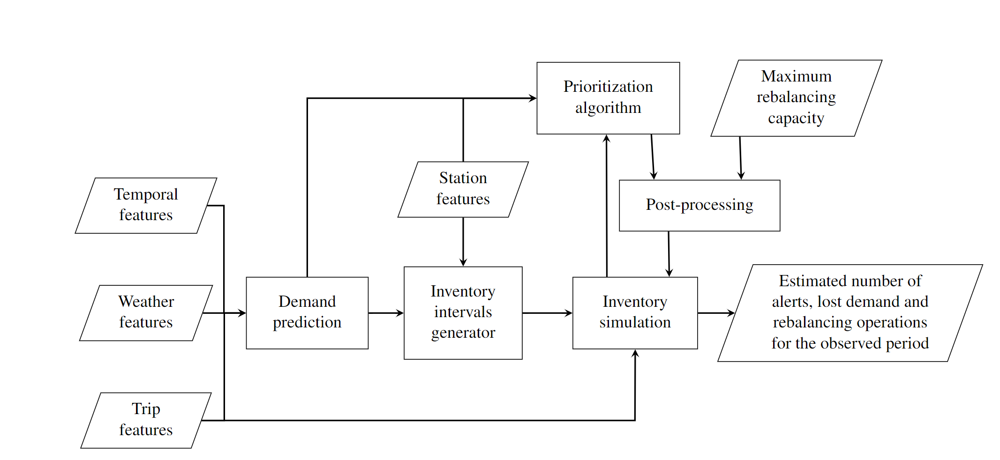
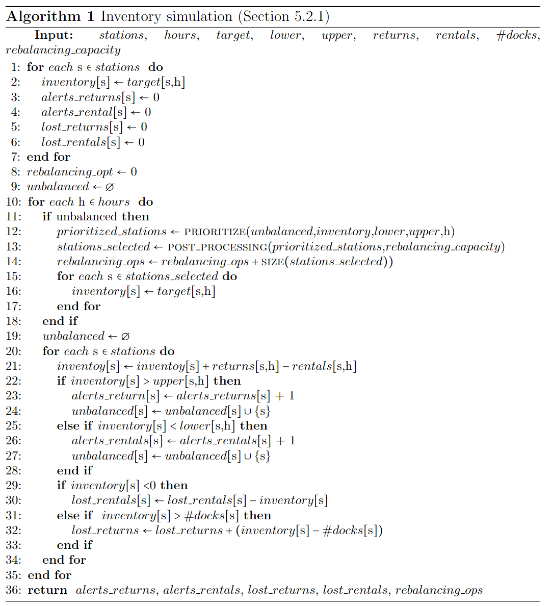
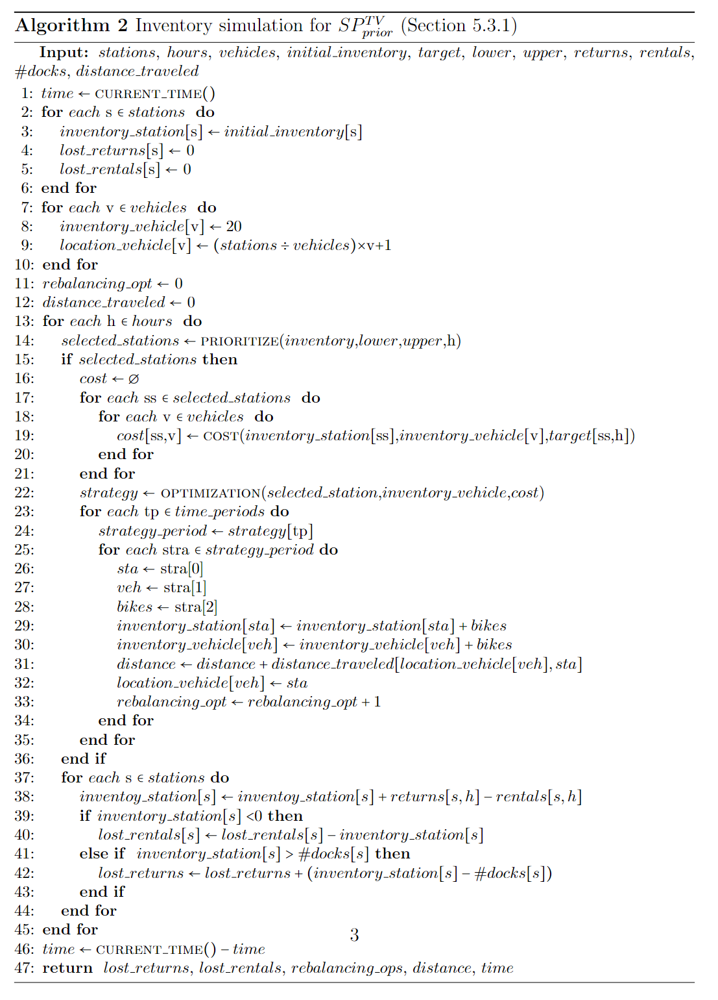

# Data-driven Prioritization Strategies for Inventory Rebalancing in Bike-sharing systems

This GitHub repository serves as an online resource for the project titled 'Data-driven Prioritization Strategies for Inventory Rebalancing in Bike-sharing Systems.' Here, we present the project's pipeline and the pseudo-code of the simulations used to estimate inventory fluctuations when applying the proposed rebalancing techniques. The images will be detailed below.

## Pipeline

<!--  -->

The pipeline depicts the structure of the data and the functions used in our model. For demand prediction, the algorithm uses trip, weather, and temporal data in order to learn trip patterns so as to predict for the next hours the number of bike rentals and returns at each station. The predicted demand is then used along with the station data (i.e., the number of docks per station) to generate the inventory intervals and to sort the unbalanced stations by the proposed prioritization strategies. Then, the list of unbalanced stations sorted according to their rebalancing priority is forwarded to the post-processing, which selects the stations to be rebalancing respecting the maximum rebalancing capacity. Finally, the simulation estimates the inventory and the performance measures based on: (i) the station and trip data (seen - training, or unseen - validation/test); (ii) the computed inventory intervals; (iii) the list of stations to be rebalanced from the post-processing. 

## Pseudo-code: Section 5.2.1

<!--  -->

This simulation receives a total of 10 input variables, which are described as follows:
* $stations$: number of stations in the network;
* $hours$ : number of simulated hours;
* $target$(s x h): the target number of bikes per station and per hour; 
* $lower$(s x h): the upper bound per station and per hour; 
* $upper$(s x h): the lower bound per station and per hour; 
* $returns$(s x h): number of returns per station and per hour; 
* $rentals$(s x h): number of rentals per station and per hour; 
* \# $docks$(s) : number of docks per station;
* $rebalancing$ \_ $capacity$: maximum number of stations that can be rebalanced per hour.

The simulation starts by initializing the inventory of each station to their respective target value. Then, the accumulator variables for the number of alerts ($alerts$ \_ $returns$ and $alerts$ \_ $rentals$), lost demand ($lost$ \_ $rentals$ and $lost$ \_ $returns$), and rebalancing operations ($rebalancing$ \_ $opt$) is initialized with zero. The list containing the unbalanced stations ($unbalanced$) is initialized as an empty list.

From lines 10 to 35, the algorithm iterates over each simulated hour. At the beginning of each hour, the simulation verifies if there are unbalanced stations that require a rebalancing operation. If so, it calls the function PRIORITIZE (line 12) to sort all the unbalanced stations according to their priority. The sorted list of unbalanced stations and the maximum rebalancing capacity are then passed to the POST-PROCESSING function (line 13),  which selects a subset of unbalanced stations to be rebalanced. In line 14, the variable $rebalancing$ \_ $ops$ updates its values by adding the number of stations selected to be rebalanced in hour $h$. Then, in lines 15-17, the inventory of the selected stations is set to their target values. After the rebalancing, the $unbalanced$ list is cleared.

From lines 20 to 34, the simulation iterates over all stations. Within this loop, the algorithm updates the inventory of the station $s$ (line 21) based on the rental and return demand at hour $h$. If the updated inventory of $s$ is above its upper bound (line 22) a return alert is raised. On the contrary, if the inventory of $s$ is below its lower bound (line 25) a rental alert is raised. In both cases, the station $s$ is added to the set of unbalanced stations. Likewise, lost demand is computed in lines 29-33 if the inventory of $s$ lies below 0 or above its number of docks. Finally, the algorithm returns information about the number of raised alerts, lost demand, and total rebalancing operations, which are used to assess the system's performance.
 
 
## Pseudo-code: Section 5.3.1 

<!--  -->

This simulation receives a total of 11 input variables, which are described as follows:
* $stations$: number of stations in the network;
* $hours$ : number of simulated hours;
* $vehicles$: number of vehicles available for rebalancing.
* $initial$ \_ $inventory$ (s):  number of bikes at each station at the initial hour.
* $target$(s x h): the target number of bikes per station and per hour; 
* $lower$(s x h): the upper bound per station and per hour; 
* $upper$(s x h): the lower bound per station and per hour; 
* $returns$(s x h): number of returns per station and per hour; 
* $rentals$(s x h): number of rentals per station and per hour; 
* \# $docks$(s) : number of docks per station;
* $distance$ \_ $traveled$ (s x s): distance between stations in the network.

The simulation begins storing the current time, which will later be used to compute the duration for the whole simulation.  Next, it initializes the variables that store information for each station (lines 2 to 6). The initial inventory is set to $initial$ \_ $inventory$, and both lost returns and lost rentals are set to 0.  Following this, the variables containing information for each vehicle are initialized (lines 7 to 10). Each vehicle's inventory is set to 20 bikes, and the initial locations of these vehicles are distributed across the stations. Finally, the variables for the number of rebalancing operations ($rebalancing$ \_ $opt$) and the distance travelled by all the vehicles ($distance$ \_ $traveled$) are set to zero. 

For each simulated hour, the algorithm sorts the unbalanced stations using the PRIORITIZE function based on inventory levels (line 14). If there are selected stations for rebalancing, the algorithm calculates the rebalancing cost per selected station and per vehicle as defined by either Eq. 17 or Eq. 18. Using these cost values, along with the inventory of the stations and vehicles, the OPTIMIZATION function determines the best rebalancing strategy for each time period (line 22). From lines 23 to 35, the algorithm decouples the rebalancing strategies ($strategy$) for each time period, adjusting the inventory of the stations, the inventory of the vehicles, and the location of the vehicles accordingly. Meanwhile, the simulation also sums up the distance travelled by the vehicles (line 31) and the rebalancing operations carried out (line 33).

After the rebalancing operations occur at the beginning of each hour, the inventory is updated based on returns and rentals for the current hour (line 38). The algorithm checks for lost rentals if the inventory is less than 0 and checks for lost returns if the inventory exceeds the number of docks (lines 39-43). In line 46, the algorithm computes the total simulation time. Finally, the simulation returns the number of lost rentals and returns, rebalancing operations, distance travelled by the vehicles, and the CPU time.

