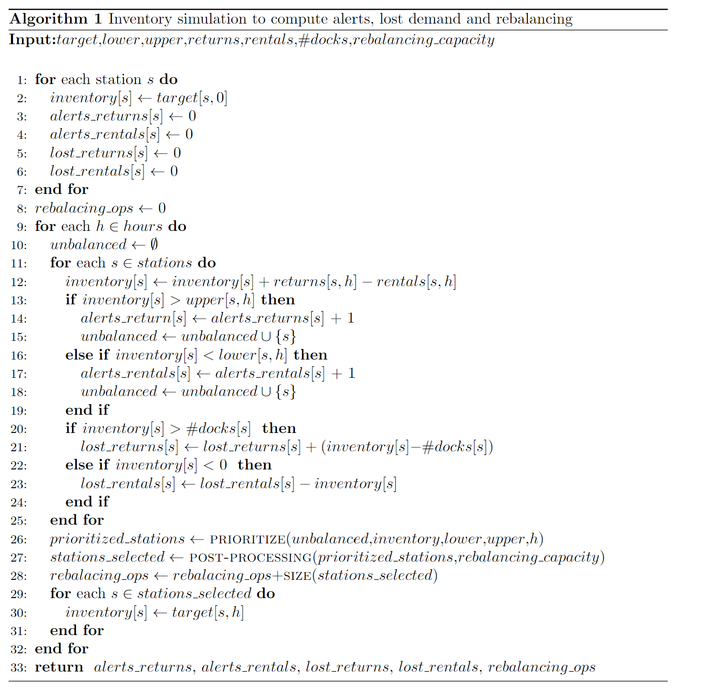

# Data-driven Prioritization Strategies for Inventory Rebalancing in Bike-sharing systems

This github is an online repository with additional information for the work titled "Data-driven Prioritization Strategies for Inventory Rebalancing in Bike-sharing systems". Here, we present the pipeline of our project and the pseudo code of the simulation used to estimate inventory flutuations when the proposed rebalancing techniques were applied. Both images will be detailed below.

### Pipeline

The pipeline depicts the structure of the data and the functions used in our model. For demand prediction, the algorithm uses trip, weather, and temporal data in order to learn trip patterns so as to predict for the next hours the number of bike rentals and returns at each station. The predicted demand is then used along with the station data (i.e., the number of docks per station) to generate the inventory intervals and to sort the unbalanced stations by the proposed prioritization strategies. Then, the list of unbalanced stations sorted accordinf to their rebalancinf priority is forward to the post-processing, which select the stations to be rebalancing respectiong the maximum rebalancing capacity. Finally, the simulation estimates the inventory and the performance measures based on: (i) the station and trip data (seen - training, or unseen - validation/test); (ii) the computed inventory intervals; (iii) the list of stations to be rebalanced from the post-processing. 

### Pseudo-code

The simulator first initializes the station inventories to their respective target value. At each subsequent time period, their inventories are updated according to the expected rental and return demand. The simulation starts with a loop in lines 1-7 that iterates over the stations to initialize the current inventories ($inventory$) and the accumulator variables for the number of alerts ($alerts\_returns$ and $alerts\_rentals$), and lost demand ($alerts\_rentals$ and $lost\_returns$). As well, in line 8,  the variable $rebalancing\_ops$, that stores the number of rebalancing operations done so far in the simulated time period,  is initialized. Next, the algorithm iterates over the simulated hours of the considered time period in lines 9-32. It assumes an empty set of $unbalanced$ stations at the beginning of each simulated hour. In the loop of lines 11-25, the algorithm proceeds by updating the inventory of each station $s$ in line~12. If the inventory of $s$ is above its upper bound in line 13 a return alert is raised. On the contrary, if the inventory of $s$ is below its lower bound in line 16 a rental alert is raised. In both cases, the station $s$ is added to the set of unbalanced stations. Likewise, lost demand is computed in lines 20-24 if the inventory of $s$ lies below 0 or above its number of docks.

After iterating over all the stations, the algorithm calls the function \textsc{prioritize} in line 26 that sorts all the unbalanced stations according to their priority. Later, the list of sorted unbalanced stations, as well as the maximum rebalancing capacity, is forward to the the function \textsc{post-processing}, in which a subset of unabalanced stations will be selected to be rebalanced. In line 28, the variable $rebalancing\_ops$ updates its values by adding the amount of stations seleted to be rebalanced in hour $h$. Then, in lines 29-31, the inventory of the selected stations are set to their target values. Finally, the algorithm returns in line~33 information about the number of raised alerts, lost demand and total rebalancing operations, which are used to assess the performance of the system.
 